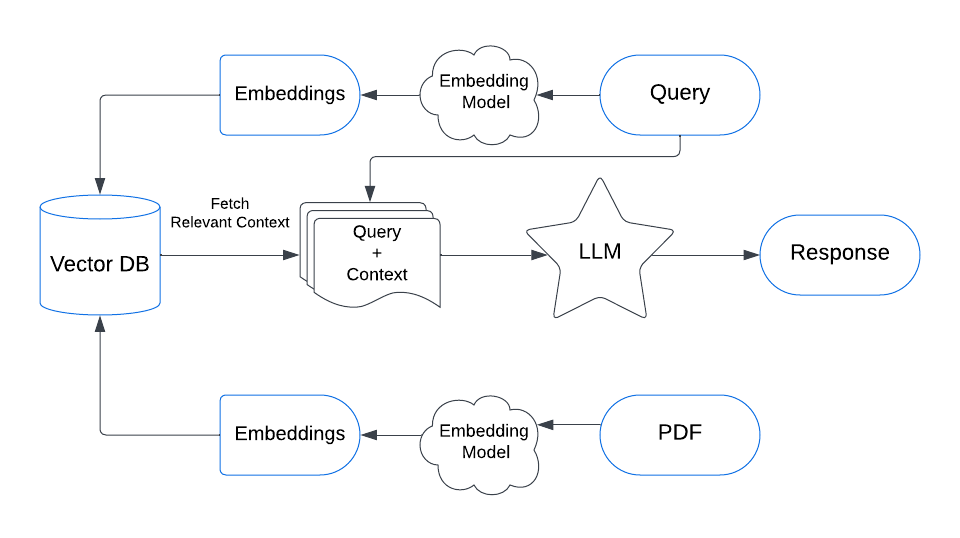

# Deployment steps:  

## Build in local:

git clone https://github.com/Rashmi96/vendor-document-analysis.git

python3 -m venv venv

source venv/bin/activate  

pip install -r requirements.txt

python run.py

## Run through streamlit

python3 -m venv venv

source venv/bin/activate  

pip install -r requirements.txt

python run main.py

## Test in local:

health check: curl -O http://localhost:5001/ping

### Document Upload:

curl -X POST -F "files=@/Users/rashmiranjanswain/Documents/myDocuments/resume/Resume_Rashmi.pdf" http://127.0.0.1:5001/uploadDocument

curl -X POST -F "files=@/Users/rashmiranjanswain/Downloads/sample1.txt" http://127.0.0.1:5001/uploadDocument

curl -X POST -F "files=@/Users/rashmiranjanswain/Downloads/Resume_Rashmi.docx" http://127.0.0.1:5001/uploadDocument

curl -X POST -F "files=@/Users/rashmiranjanswain/Downloads/temp.xlsx" http://127.0.0.1:5001/uploadDocument

### List documents from these directories:

curl "http://127.0.0.1:5001/list-files?dir_path=downloads"

curl "http://127.0.0.1:5001/list-files?dir_path=uploads"

### Download Document from /reports folder:

curl -O http://localhost:5001/reportDownload/Resume1.pdf

Extract details from all the files present in /uploads folder
curl -O http://localhost:5001/extract

## Deploy through Docker:

Build/push the Docker image
docker build --no-cache -t rashmi9678/vendor-document-analysis:latest .
docker login
docker push rashmi9678/vendor-document-analysis:latest

kubectl apply -f ./kubernetes/deployment.yaml
kubectl apply -f ./kubernetes/service.yaml

docker run -p 8080:8080 rashmi9678/vendor-document-analysis

kubectl get services

## Test through Docker

http://0.0.0.0:8080/ping
curl -X POST -F "files=@/Users/rashmiranjanswain/Downloads/sample1.txt" http://0.0.0.0:8080/uploadDocument
curl -X POST -F "files=@/Users/rashmiranjanswain/Downloads/Rashmi_Adhaar.pdf" http://0.0.0.0:8080/uploadDocument
curl -O http://0.0.0.0:8080/extract

## GCP deplyment steps:

project Id: finance-hackathon-2024

enable - https://console.developers.google.com/apis/api/artifactregistry.googleapis.com/overview?project=407460419649

gcloud projects add-iam-policy-binding finance-hackathon-2024 --member='user:swain96@gmail.com' --role='roles/artifactregistry.writer'

gcloud auth configure-docker

docker buildx create --use

docker buildx build --platform linux/arm64,linux/amd64 -t us-central1-docker.pkg.dev/finance-hackathon-2024/my-docker-repo/vendor-document-analysis --push .

gcloud config set project finance-hackathon-2024

gcloud artifacts repositories list --location=us-central1

gcloud artifacts repositories create my-docker-repo \
--repository-format=docker \
--location=us-central1 \
--description="Docker repository"

docker pull us-central1-docker.pkg.dev/finance-hackathon-2024/my-docker-repo/vendor-document-analysis

gcloud run deploy vendor-document-analysis --image us-central1-docker.pkg.dev/finance-hackathon-2024/my-docker-repo/vendor-document-analysis --platform managed --region us-central1 --allow-unauthenticated

## Test through GCP:

curl -X POST -F "files=@/Users/rashmiranjanswain/Downloads/sample1.txt" https://vendor-document-analysis-407243589898.us-central1.run.app/uploadDocument

## High Level Design

